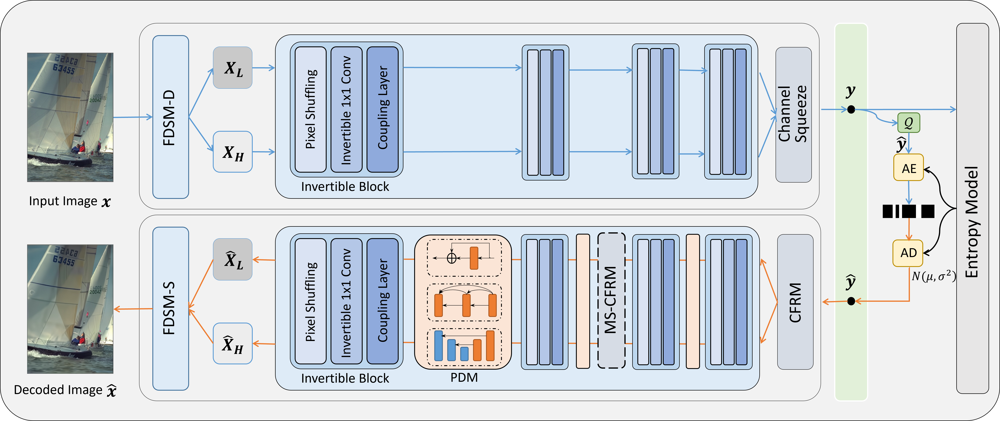

<div align="center">
<h1>AINNCompress (TIP 2025)</h1>
<h3>Approximately Invertible Neural Network for Learned Image Compression</h3>
</div>


This is the Pytorch repository of the paper "[Approximately Invertible Neural Network for Learned Image Compression](https://ieeexplore.ieee.org/document/11003432)".



### Abstract

Learned image compression has attracted considerable interests in recent years. An analysis transform and a synthesis transform, which can be regarded as coupled transforms, are used to encode an image to latent feature and decode the feature after quantization to reconstruct the image. Inspired by the success of invertible neural networks in generative modeling, invertible modules can be used to construct the coupled analysis and synthesis transforms. Considering the noise introduced in the feature quantization invalidates the invertible process, this paper proposes an Approximately Invertible Neural Network (A-INN) framework for learned image compression. It formulates the rate-distortion optimization in lossy image compression when using INN with quantization, which differentiates from using INN for generative modelling. Generally speaking, A-INN can be used as the theoretical foundation for any INN based lossy compression method. Based on this formulation, A-INN with a progressive denoising module (PDM) is developed to effectively reduce the quantization noise in the decoding. Moreover, a Cascaded Feature Recovery Module (CFRM) is designed to learn high-dimensional feature recovery from low-dimensional ones to further reduce the noise in feature channel compression. In addition, a Frequency-enhanced Decomposition and Synthesis Module (FDSM) is developed by explicitly enhancing the high-frequency components in an image to address the loss of high-frequency information inherent in neural network based image compression, thereby enhancing the reconstructed image quality. Extensive experiments demonstrate that the proposed A-INN framework achieves better or comparable compression efficiency than the conventional image compression approach and state-of-the-art learned image compression methods.

### Installation

Clone this repository:

```bash
git clone https://github.com/sdu-visual/LIC-AINN.git
```

Prepare virtual environment:

```bash
conda create -n AINNComp python=3.8
conda activate AINNComp
```

Install required packages:

```bash
pip install torch==2.4.1 torchvision==0.19.1 torchaudio==2.4.1 --index-url https://download.pytorch.org/whl/cu124
```

```bash
cd codes/
pip install -U pip && pip install -e .
```

**Testing is conducted for the specific version mentioned above; other versions may run well.**

### Datasets

Download [Kodak](https://r0k.us/graphics/kodak/) for evaluation.

### Evaluation on CPU

As following the instructions of [CompressAI](https://github.com/InterDigitalInc/CompressAI) library:

```python
python3 -m compressai.utils.eval_model checkpoint [path to test images] -a [model name] --path [path of pretrained checkpoint] --metric [evaluation metric] -d [output directory] -o [output file]
```

Example:

```python
python3 -m compressai.utils.eval_model checkpoint ./kodim24/ -a AINNCompression --path experiments/inv_exp_03_mse_lmd0032_q3/checkpoints/updated/checkpoint_best_loss-27a39582.pth.tar --metric mse -d experiments/inv_exp_03_mse_lmd0032_q3/checkpoints/updated/ -o kodak.json
```

> Note: please remember to update  the CDFs parameters of a trained model.
>
> ```python
> python3 -m compressai.utils.update_model -a [model name] -d [directory of storing updated checkpoint] [path of pretrained checkpoint]
> ```
>
> Example:
>
> ```python
> python3 -m compressai.utils.update_model -a AINNCompression -d experiments/inv_exp_03_mse_lmd0032_q3/checkpoints/updated experiments/inv_exp_03_mse_lmd0032_q3/checkpoints/checkpoint_best_loss.pth.tar 
> ```

### Acknowledgement

We sincerely thank the authors of the following codebases. Their excellent work provided valuable references for our project: [InvCompress](https://github.com/xyq7/InvCompress/tree/main), [CompressAI](https://github.com/InterDigitalInc/CompressAI).

 We have modified the same locations of code as [InvCompress](https://github.com/xyq7/InvCompress/tree/main), Please refer to their implementation if you encounter any issues.

### Citation

If you find AINNCompress is useful for your research and applications, please consider citing:

```
@article{gao2025approximately,
  title={Approximately Invertible Neural Network for Learned Image Compression},
  author={Gao, Yanbo and Li, Shuai and Fu, Meng and Lv, Chong and Yang, Zhiyuan and Cai, Xun and Yuan, Hui and Ye, Mao},
  journal={IEEE Transactions on Image Processing},
  year={2025},
  publisher={IEEE}
}
```

